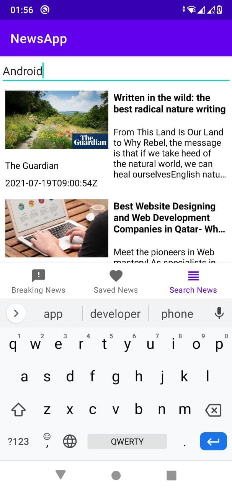
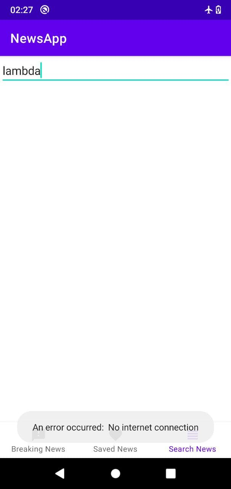

# NewsApp
News App (MVVM, retrofit, Room, Glide, Navigation, Coroutines)

The app uses the API https://newsapi.org/

Example @Get
https://newsapi.org/v2/everything?q=tesla&from=2021-06-29&sortBy=publishedAt&apiKey=........

This application consists of three screens : BreakingNews , Saved News and Search News.

Breaking News screen:

Search News screen:

After clicking on the news, open a detailed article 

Detailed article: 

If you save the article (clicking on the floating Fab button), then the article will be added to Saved News and saved to Room database.

You can delete an article by swiping to the right or to the left. 
Snackbar will prompt you to cancel the deletion. If you cancel the article will remain

If you do not have an internet connection, you will receive an error message:

